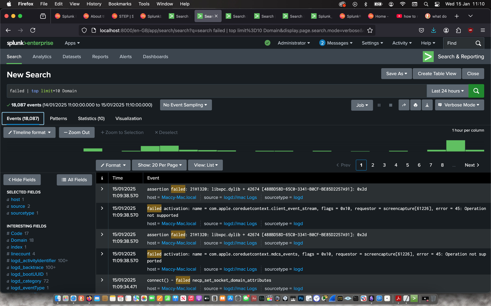
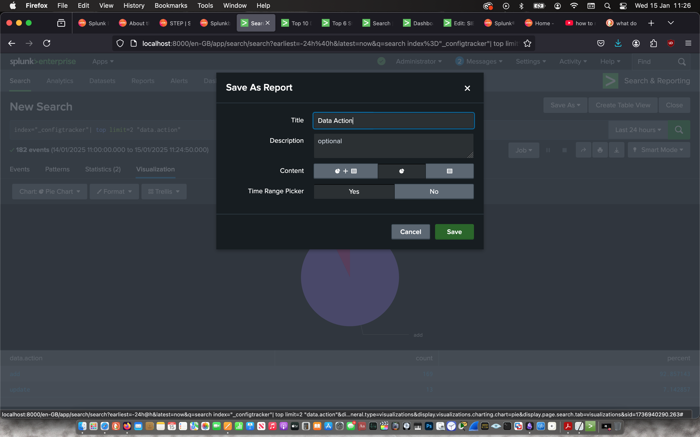

After downloading the splunk’s dmg file from their official website, I ran a hash check on the file to make ensure its integrity.


I double-clicked the installer and followed the instructions. I’ve provided screenshots below to highlight every time I was prompted.

 | 

 | 

 | 

 | 

 | 


Created a username and password for my admin splunk account and started the web application.

 | 


Then I signed in and immediately ingested the log data from my laptop.

 | 

 | 

 | 


Then I used the “Search & Reporting” app to search for the top domains with the most failed processes with the command:
```
failed | top limit=10 Domain
```
Then I used the visualisation feature create a pie chart to represent the information and saved it as a report to later add it to a Dashboard. From this visualisation, I can determine that NSCocoa Domain had the most failed processes which willed a further investigation.

 | 


Then I used the “Search & Reporting” app to search for the status of processes on the internal system with the command:
```
index=“_internal” | top limit=6 status
```
Then I used the visualisation feature create a bar chart to represent the information and saved it as a report to later add it to a Dashboard. From this visualisation, over 90% of the processes have a  status of 200 which signifies a smooth running system.

 | 


Then I used the “Search & Reporting” app to search for the actions taken on the config data with the command:
```
index=“_configtracker” | top limit=2 “data.action””
```
Then I used the visualisation feature create a pie chart to represent the information and saved it as a report to later add it to a Dashboard. From the pie chart, I can determine that only 7% of the config data was updated.

 | 




I Created a new dashboard in classic mode.

 | 


Then I imported all three reports into the dashboard.

 | 

 | 


Finally, I cloned my dashboard in dashboard studio in grid mode for a better presentation.

 | 

 | 
